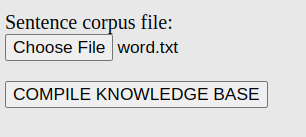
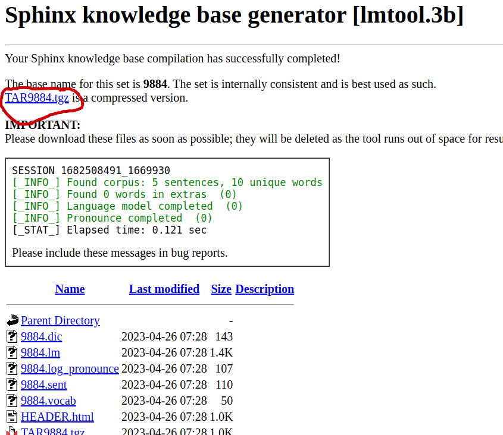
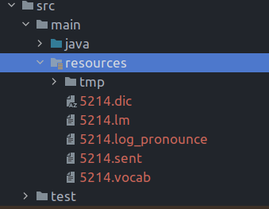

# Voice Assistant in Java

## Dependencies
- sphinx4-data
- sphinx4-core
- [FreeTTS](https://freetts.sourceforge.io/)

## Sources
- [http://www.infybuzz.com/](http://www.infybuzz.com/2021/01/how-to-create-your-own-voice-assistant-in-java.html)
- [https://coderspacket.com/](https://coderspacket.com/voice-assistance-app-using-java)


## Added new voice command
1. Create txt file
```txt
open project
open chrome
open youtube
open calculator
play music
```
2. Upload file
[http://www.speech.cs.cmu.edu/tools/lmtool-new-debug.html](http://www.speech.cs.cmu.edu/tools/lmtool-new-debug.html)



3. Download and unzip to resources folder

